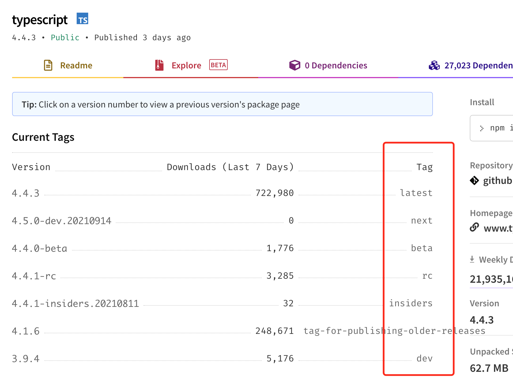

# Lerna example

## 开始的基本操作

```bash
$ mkdir lerna-example && cd $_
$ npm install lerna -D
# 采用独立模式
$ npx lerna init --independent
```

> `lerna.json`的相关解释[到这里](https://github.com/lerna/lerna#lernajson)

## 创建三个 package

在`packages`下新增三个 package

```bash
├── package-a
│   ├── index.js
│   └── package.json
├── package-b
│   ├── index.js
│   └── package.json
└── package-c
    ├── index.js
    └── package.json
```

运行`lerna bootstrap`安装依赖。（lerna 架构，不推荐使用 npm install）

> 那么根部装了`eslint`，即使`package-c`中没有装 eslint，也没有依赖 eslint。
> 执行`npx lerna run eslint`，package-c 也能正确连接到 eslint 的 CLI，**需要在根部执行命令**

根部 package.json

```json
{
  "devDependencies": {
    "lerna": "^4.0.0",
    "eslint": "^7.32.0"
  }
}
```

package-c/package.json

```json
{
  "dependencies": {
    "package-b": "1.0.0"
  }
}
```

## 执行命令

执行命令有：[`lerna run <script> -- [..args]`](https://github.com/lerna/lerna/tree/main/commands/run#readme)和[`lerna exec -- <command> [..args]`](https://github.com/lerna/lerna/tree/main/commands/exec#readme)两种方式

### 当前工作目录的问题

如果在根目录运行`npx lerna run eslint`，那么`eslint`在找相关配置文件时会在根目录找。对于旧的项目，子包中的 eslint 版本或者配置可能并不同，为了保证正确执行，需要在子包中安装对应的`eslint`。

## 添加 packages

### 新的 packages

在`packages`文件夹中为你的的 package 创建一个目录，然后正常运行 `npm init` 为你的的新包创建 package.json。

或者使用[`lerna create <name> [loc]`](https://github.com/lerna/lerna/tree/main/commands/create#readme)

### 已存在的 packages

> `lerna import`存在 bug，提交历史比较多的项目会出现导入后代码缺失，不是最新的。

您可以使用 [lerna import <package>](https://github.com/lerna/lerna/blob/main/commands/import/README.md) 将现有 package 传输到您的 Lerna 存储库中；此命令将保留提交历史记录。

[lerna import <package>](https://github.com/lerna/lerna/blob/main/commands/import/README.md) 采用本地路径而不是 URL。在这种情况下，你将需要在你的文件系统上拥有您希望链接到的存储库。

#### [--preserve-commit](https://github.com/lerna/lerna/tree/main/commands/import#--preserve-commit)

建议使用`--preserve-commit`，因为这样可以保留原始的 commit 人员的记录

```bash
$ cd ~/Product

# 查看路径
$ pwd

$ lerna import ~/Product --preserve-commit
```

### 使用[`lerna add`](https://github.com/lerna/lerna/tree/main/commands/add#readme)替代`npm install`

比如要将`lodash`装到`package-a`下

```
npx lerna add lodash --scope=package-a
```

做为`devDependencies`依赖

```
npx lerna add lodash --scope=package-a --dev
```

## lerna version

下面我们从 lerna version 开始探索 lerna 的工作流

Make changes && Commit those changes

```bash
$ git add .
$ git commit -m "xxxx"
```

直接执行`lerna version`，如果没有关联远程仓库的情况下，会有如下报错：

```bash
$ npx lerna version

lerna notice cli v4.0.0
lerna info versioning independent
lerna ERR! ENOREMOTEBRANCH Branch 'master' doesn't exist in remote 'origin'.
lerna ERR! ENOREMOTEBRANCH If this is a new branch, please make sure you push it to the remote first.

```

由于`lerna version`会默认提交到远程仓库，如果我们不想让它自动`git push`,可以执行`npx lerna version --no-push`，之后让选择各个 package 的版本号：

```bash
$ npx lerna version --no-push
lerna notice cli v4.0.0
lerna info versioning independent
lerna info Assuming all packages changed
? Select a new version for package-a (currently 1.0.0) Prepatch (1.0.1-alpha.0)
? Select a new version for package-b (currently 1.0.0) Preminor (1.1.0-alpha.0)
? Select a new version for package-c (currently 1.0.0) (Use arrow keys)
❯ Patch (1.0.1)
  Minor (1.1.0)
  Major (2.0.0)
  Prepatch (1.0.1-alpha.0)
  Preminor (1.1.0-alpha.0)
  Premajor (2.0.0-alpha.0)
  Custom Prerelease
  Custom Version
```

选择完后确认版本，`y`确认：

```bash
lerna notice cli v4.0.0
lerna info versioning independent
lerna info Assuming all packages changed
? Select a new version for package-a (currently 1.0.0) Prepatch (1.0.1-alpha.0)
? Select a new version for package-b (currently 1.0.0) Preminor (1.1.0-alpha.0)
? Select a new version for package-c (currently 1.0.0) Patch (1.0.1)

Changes:
 - package-a: 1.0.0 => 1.0.1-alpha.0
 - package-b: 1.0.0 => 1.1.0-alpha.0
 - package-c: 1.0.0 => 1.0.1

? Are you sure you want to create these versions? (ynH)
```

然后，就会生成一个 release 相关的 commit，以及三个 git tag（三个包各一个 tag）

## 使用 lerna [--conventional-commits](https://github.com/lerna/lerna/tree/main/commands/version#--conventional-commits)生成 changelog

如果不是显式的执行`lerna version --conventional-commits`，则不会生成`CHANGELOG.md`文件。

相关选项还有：

- [--conventional-graduate](https://github.com/lerna/lerna/tree/main/commands/version#--conventional-graduate)
- [--conventional-prerelease](https://github.com/lerna/lerna/tree/main/commands/version#--conventional-prerelease)

### 使用

lerna.json 中增加如下配置

```json
{
	"version": {
     "changelogPreset": {
        "name": "conventionalcommits",
        "types": [
          { "type": "feat", "section": "🎸 Features" },
          { "type": "feature", "section": "🎸 Features" },
          { "type": "fix", "section": "🐛 Bug Fixes" },
          { "type": "perf", "section": "⚡️ Performance Improvements" },
          { "type": "revert", "section": ":rewind: Reverts" },
          { "type": "docs", "section": "Documentation", "hidden": true },
          { "type": "style", "section": "Styles", "hidden": true },
          {
            "type": "chore",
            "section": "Miscellaneous Chores",
            "hidden": true
          },
          {
            "type": "refactor",
            "section": "💡 Code Refactoring",
            "hidden": true
          },
          { "type": "test", "section": "Tests", "hidden": true },
          { "type": "build", "section": "Build System", "hidden": true },
          { "type": "ci", "section": "Continuous Integration", "hidden": true }
        ]
      }
    }
  }
}
```

```bash
# 根目录安装 conventional-changelog-conventionalcommits
$ npm install conventional-changelog-conventionalcommits -D

# 执行
$ lerna version --no-push --conventional-commits
```

使用`--conventional-commits`后就不能像上面给每个包自主选择版本号了，会变成如下形式：

```bash
lerna info versioning independent
lerna info Looking for changed packages since @buibis/package-a@1.0.2-alpha.0
lerna info ignoring diff in paths matching [ 'ignored-file', '*.md' ]

Changes:
 - package-a: 1.0.2-alpha.0 => 1.0.3-alpha.0
 - package-b: 1.2.0-alpha.0 => 1.2.1-alpha.0
 - package-c: 0.0.3-alpha.0 => 0.0.4-alpha.0

? Are you sure you want to create these versions? Yes
```

#### [semver bump](https://github.com/lerna/lerna/tree/main/commands/version#semver-bump)，可供选择：

```bash
lerna version [major | minor | patch | premajor | preminor | prepatch | prerelease]
# uses the next semantic version(s) value and this skips `Select a new version for...` prompt
```

比如，可以这样：

```json
{
  "scripts": {
    "r": "lerna version --no-push --conventional-commits"
  }
}
```

```bash
$ npm run r prepatch
```

## lerna version 时忽略某个包

如果我们在执行`lerna version`相关操作时，想要将某个包忽略，如将`package-b`忽略，则可：

```bash
$ npx lerna version --no-push --conventional-commits --ignore-changes 'packages/package-b/**'
```

如果忽略多个

```bash
$ npx lerna version --no-push --conventional-commits --ignore-changes 'packages/package-b/**' 'packages/package-a/**'
```

### 不能忽略的情况或者更新联动

预发布的版本(无^~的版本)和精确的版本(无^~的版本)且非本地当前的版本，才不会受到联动更新。

比如`package-b`中依赖的`package-a`的版本不是本地的版本`1.0.5-alpha.0`，而是线上的`1.0.3-alpha.0`。那么在更新`package-a`时，`package-b`就不会受到联动更新了。

注意 ⚠️：在你降到了精确的版本后，要重新`npx lerna bootstrap`，确保`node_modules`中的依赖变更成更改后的实际版本。

1. b 包做了修改（当前版本是 1.2.5），c 包依赖的 b 包版本改为无箭头的 1.2.5，执行 version 时忽略 c 包

   ```bash
   $ npx lerna version --no-push --conventional-commits --ignore-changes 'packages/package-c/**'

   # c包依然触发更新版本，无法被忽略
   Changes:
   - @buibis/package-b: 1.2.5 => 1.3.0
   - @buibis/package-c: 0.0.9 => 0.0.10

   ```

## 加入 Lint 流程

Lint 步骤一般放在更新版本号之前，即`preversion`，在每个子包的 package.json 的 scripts 设置如下：

```json
{
  "scripts": {
    "preversion": "npm run codecheck",
    "codecheck": "echo \"开始codecheck\""
  }
}
```

或者结合`lint-staged`、`husky`、`git hooks`进行，如：

```json
{
  "scripts": {
    "lint-staged": "lint-staged"
  },
  "husky": {
    "hooks": {
      "pre-commit": "npm run lint-staged"
    }
  }
}
```

## 加入测试流程

测试步骤也需要放在`preversion`时，在每个子包的 package.json 的 scripts 设置如下：

```json
{
  "scripts": {
    "preversion": "npm run test",
    "test": "echo \"测试通过\""
  }
}
```

因为在`preversion`时，包的`node_modules`已将依赖更新至最新。如果`package-b`依赖的`package-a`有修改，也会触发`package-b`的`version lifecycle`，那么在`preversion`时，`package-b`才能拿到`package-a`的最新代码。

## 加入构建流程

构建步骤放在`version`时，在每个子包的 package.json 的 scripts 设置如下：

```json
{
  "scripts": {
    "version": "npm run build",
    "build": "echo \"开始build\""
  }
}
```

## 使用[`lerna publish`](https://github.com/lerna/lerna/tree/main/commands/publish#lernapublish)将包发布到 npm registry

有三个命令：

```bash
lerna publish              # publish packages that have changed since the last release
lerna publish from-git     # explicitly publish packages tagged in the current commit
lerna publish from-package # explicitly publish packages where the latest version is not present in the registry
```

我们使用`lerna publish from-package`，因为前两个还是会提示你更改版本号，我们现在的工作流并不需要。

### lerna publish [--canary] [--dist-tag <tag>]

npm 包可以设置 Current Tags，`npm install`安装的是`latest`tag 上的最新版本。可以使用命令`npm publish [--tag <tag>]`，发布后的包，在 npm 源上表现形式如下：



**在 lerna 中，如何在使用`lerna publish`时，给版本打 tag 呢？**

1.  （失败）`npm run p --canary`

        package.json

        ```json
        {
        	"scripts": {
            "p": "lerna publish from-package"
          },
        }
        ```

        ```bash
        $ npm run p --canary
        ```

2.  （tag 不符合预期）`npx lerna publish from-package --canary --preid alpha`

    最终发布的包 tag 还是`canary`

3.  （成功，且符合预期）`npx lerna publish from-package --dist-tag alpha`

    成功！最终发布的包 tag 为`alpha`

### [per-package-configuration](https://github.com/lerna/lerna/tree/main/commands/publish#per-package-configuration)

子包可以使用特殊的 publishConfig 进行配置，会更改 lerna publish 的行为。

- [publishConfig.access](https://github.com/lerna/lerna/tree/main/commands/publish#publishconfigaccess)

  如果是`@scope`包，publishConfig.access 要设为`public`，不然会导致发包失败。

- [publishConfig.registry](https://github.com/lerna/lerna/tree/main/commands/publish#publishconfigregistry)

  如果有私有 npm registry，需要设置 publishConfig.registry

- [publishConfig.directory](https://github.com/lerna/lerna/tree/main/commands/publish#publishconfigdirectory)

  如果需要指定发包的文件夹，可设置 publishConfig.directory

## 包的依赖及更新

[npm 的 preversion、version、postversion 的执行顺序](https://docs.npmjs.com/cli/v6/commands/npm-version)

[`lerna version`的生命周期脚本](https://github.com/lerna/lerna/tree/main/commands/version#lifecycle-scripts)

```bash
// preversion:  Run BEFORE bumping the package version.
// version:     Run AFTER bumping the package version, but BEFORE commit.
// postversion: Run AFTER bumping the package version, and AFTER commit.
```

lerna 会分析包及包的依赖更新，假设：package-c 依赖 package-b，package-b 依赖 package-a。在一次更改中，package-a 被更改后，运行`lerna version --no-push --conventional-commits prepatch`，lerna 工作的流程如下：

- 先执行`package-a`
  - Run preversion lifecycle
  - Update version in package.json
  - Run version lifecycle
- 执行`package-b`
  - Run preversion lifecycle
  - Update version in package.json
  - Run version lifecycle
- 最后执行`package-c`
  - Run preversion lifecycle
  - Update version in package.json
  - Run version lifecycle

测试流程放在`preversion`时，构建流程放在`version`时，且如果出错了需`git checkout -- .`清除受 `bump` 影响的文件。这样的工作流就确保了依赖和被依赖的测试及构建流程能够符合预期。

### CHANGELOG.md

依然接上面的场景，`package-a`被更改后的 git commit，在生成 changelog 时，只会出现在`package-a`的`CHANGELOG.md`中。`package-b`和`package-c`由于只是被动依赖触发的版本更新，所以更新的 changelog 内容如下：

```
### [1.2.4-alpha.0](https://github.com/zqinmiao/lerna-example/compare/@buibis/package-b@1.2.3-alpha.0...@buibis/package-b@1.2.4-alpha.0) (2021-08-09)

**Note:** Version bump only for package @buibis/package-b

```

## 将本地代码 push 至远程

通常，在将各个包发布到远程 registry 后，应当第一时间将本地代码 push 至远程 git 仓库。所以应当在根目录`package.json`中的设置如下 script：

```bash
{
	"scripts": {
    "postpublish": "git push && git push origin --tags"
  },
}
```

## [Lerna Frequently asked questions](https://github.com/lerna/lerna/blob/main/FAQ.md)
