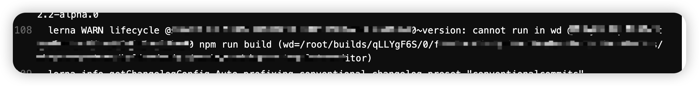

## gitlab CI 中报错：`lerna ERR! ENOGIT Detached git HEAD, please checkout a branch to choose versions.`

本以为是以下的原因导致的：

> 这是因为执行`npx lerna version prerelease --no-push --conventional-commits`时，默认会情况下终端中会有确认操作。我们需要让其默认行为就是 yes，所以需要在命令中加上`--yes`：`npx lerna version prerelease --no-push --conventional-commits --yes`

其实是默认 gitlab CI 只是浅克隆了项目，我们需要`checkout`到目标分之，所以，我们需要在执行 lerna 命令时，先`git checkout alpha`到目标分支

## gitlab CI 中报错：`lerna WARN lifecycle xx~version: cannot run in wd xx npm run build`

这是因为：

> 如果 npm 是以 root 权限调用的，那么它将把 uid 改为用户配置所指定的用户账户或 uid，默认为 nobody。设置 unsafe-perm 标志，以便以 root 权限运行脚本。

[相关问题](https://stackoverflow.com/questions/18136746/npm-install-failed-with-cannot-run-in-wd)
